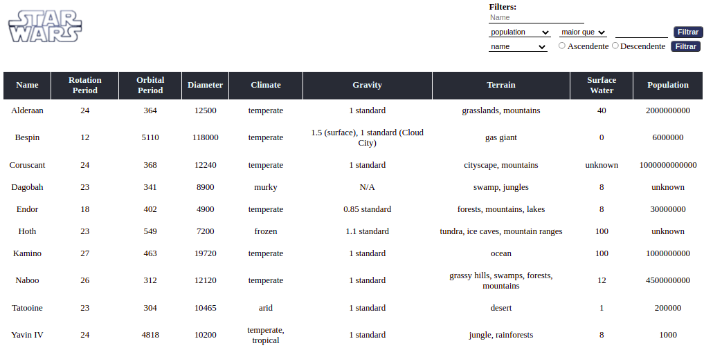

<h1 align="center">
  Projeto Star Wars Planets
</h1>

  <a href="#-tecnologias">Tecnologias</a>&nbsp;&nbsp;&nbsp;|&nbsp;&nbsp;&nbsp;
  <a href="#-projeto">Projeto</a>&nbsp;&nbsp;&nbsp;|&nbsp;&nbsp;&nbsp;
  <a href="#-deploy">Deploy</a>

 

 

  

## 🚀 Tecnologias

Esse projeto foi desenvolvido com as seguintes tecnologias:

- HTML
- CSS
- React (Hooks e Context API)

## 💻 Projeto

O projeto Star Wars Planets, consiste na requisição de dados dos filmes do Star Wars através da API de Star Wars, utilizando-se de React Hooks e Context API, para gerenciar o estado da aplicação e utilização de filtros.

## 🔖 Deploy

Você pode visualizar a aplicação do projeto através [desse link](https://isaaccruzlm.github.io/StarWarsPlanets/).

---

By Isaac Cruz Leite Machado :wave:.

